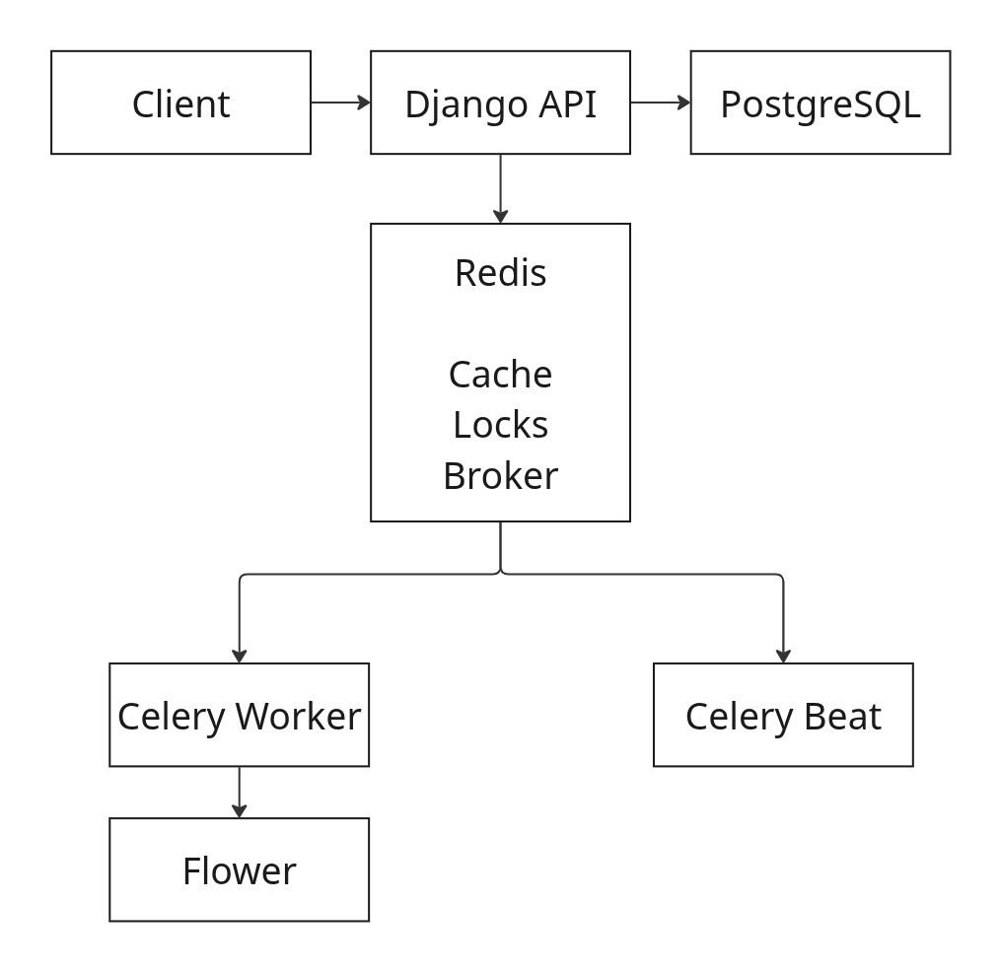

# E-commerce Order Management API

Production grade Django REST API for e-commerce order management with distributed locking, async task processing, and comprehensive observability.

## Features

### Core Functionality

- **Order Management**: Create, view, and manage orders with multiple items
- **Inventory Control**: Real time stock tracking with distributed locking
- **Payment Integration**: Webhook processing for payment providers
- **Async Processing**: Background email sending and scheduled tasks

### Production Ready Patterns

- **Distributed Locking**: Redis based locks prevent race conditions and overselling
- **Idempotency**: Safe retry logic for webhooks and scheduled tasks
- **Rate Limiting**: API endpoint protection (5 req/min per user)
- **Caching**: Redis caching for product listings

### Observability

- **Structured Logging**: JSON logs with request tracing
- **Metrics**: Prometheus metrics for orders, response times, and system health
- **Monitoring**: Grafana dashboards for real time visualization
- **Task Monitoring**: Flower dashboard for Celery task tracking
- **Dead Letter Queue**: Failed task tracking and manual retry capability

## Architecture



## Prerequisites

- Docker & Docker Compose
- Python 3.12+ (for local development)
- uv (Python package manager)

## Quick Start

### Using Docker (Recommended)

1. **Clone the repository**

```bash
   git clone https://github.com/aayodejii/django-ecommerce-api.git
   cd django-ecommerce-api
```

2. **Set up environment variables**

```bash
   cp .env.example .env
   # Edit .env with your settings
```

3. **Start all services**

```bash
   docker compose up -d
```

4. **Run migrations**

```bash
   docker compose exec web uv run python manage.py migrate
```

5. **Create superuser**

```bash
   docker compose exec web uv run python manage.py createsuperuser
```

6. **Access the application**
   - API: http://localhost:8000
   - Admin: http://localhost:8000/admin
   - API Docs: http://localhost:8000/api/
   - Flower (Celery): http://localhost:5555
   - Grafana: http://localhost:3000 (admin/admin)
   - Prometheus: http://localhost:9090

### Local Development (Without Docker)

1. **Install dependencies**

```bash
   uv sync
```

2. **Start Redis**

```bash
   docker run -d -p 6379:6379 redis:8
```

3. **Start PostgreSQL**

```bash
   docker run -d -p 5432:5432 \
     -e POSTGRES_DB=ecommerce \
     -e POSTGRES_USER=postgres \
     -e POSTGRES_PASSWORD=postgres \
     postgres:17
```

4. **Run migrations**

```bash
   uv run python manage.py migrate
```

5. **Start services in separate terminals**

```bash
   # Terminal 1: Django
   uv run python manage.py runserver

   # Terminal 2: Celery Worker
   uv run celery -A ecommerce_api worker --loglevel=info

   # Terminal 3: Celery Beat
   uv run celery -A ecommerce_api beat --loglevel=info

   # Terminal 4: Flower
   uv run celery -A ecommerce_api flower
```

## API Usage

### Authentication

Get JWT token:

```bash
curl -X POST http://localhost:8000/auth/jwt/create/ \
  -H "Content-Type: application/json" \
  -d '{"username": "your_username", "password": "your_password"}'
```

### Create Order

```bash
curl -X POST http://localhost:8000/orders/ \
  -H "Authorization: JWT YOUR_JWT_TOKEN" \
  -H "Content-Type: application/json" \
  -d '{
    "items": [
      {"product_id": "product-uuid", "quantity": 2}
    ]
  }'
```

### Get Orders

```bash
curl http://localhost:8000/orders/ \
  -H "Authorization: JWT YOUR_JWT_TOKEN"
```

### Simulate Payment Webhook

```bash
curl -X POST http://localhost:8000/webhooks/payment/ \
  -H "Content-Type: application/json" \
  -d '{
    "event_id": "evt_123",
    "reference": "ORD-ABC123",
    "status": "success",
    "amount": 10000
  }'
```

## Docker Commands

```bash
# Start all services
docker compose up -d

# View logs
docker compose logs -f web
docker compose logs -f celery_worker

# Stop all services
docker compose down

# Rebuild after code changes
docker compose up -d --build

# Run migrations
docker compose exec web uv run python manage.py migrate

# Create superuser
docker compose exec web uv run python manage.py createsuperuser

# Django shell
docker compose exec web uv run python manage.py shell

# Run tests
docker compose exec web uv run python manage.py test

# Retry failed tasks
docker compose exec web uv run python manage.py retry_failed_tasks --all
docker compose exec web uv run python manage.py retry_failed_tasks --task-id task-id
```

## Monitoring

### Grafana Dashboards

Access Grafana at http://localhost:3000 (admin/admin)

**Key Metrics:**

- Orders created per minute
- Order creation time (p50, p95, p99)
- Redis lock success rate
- HTTP response status codes
- Celery task success rate
- Active orders count
- Low stock product alerts

### Flower (Celery Monitoring)

Access Flower at http://localhost:5555

**Features:**

- Real-time task monitoring
- Worker status and pool size
- Task success/failure rates
- Task execution history
- Retry and revoke tasks

### Prometheus Metrics

Access Prometheus at http://localhost:9090

**Custom Metrics:**

- `orders_created_total` - Total orders by status
- `order_creation_duration_seconds` - Order creation time histogram
- `redis_lock_acquisitions_total` - Lock acquisition success/failure
- `celery_task_duration_seconds` - Task execution time
- `active_orders_total` - Current pending orders
- `low_stock_products_total` - Products below threshold

## Testing

### Run Tests

```bash
docker-compose exec web uv run python manage.py test
```

### Test Concurrency (Race Conditions)

```python
# test_concurrency.py
import requests
import threading

def create_order():
    response = requests.post(
        'http://localhost:8000/orders/',
        headers={'Authorization': 'JWT YOUR_TOKEN'},
        json={'items': [{'product_id': 'PRODUCT_ID', 'quantity': 1}]}
    )
    print(f"Status: {response.status_code}")

# Set product stock to 1, then run 5 concurrent requests
threads = [threading.Thread(target=create_order) for _ in range(5)]
for t in threads:
    t.start()
for t in threads:
    t.join()

# Expected: 1 success (201), 4 failures (400 - insufficient stock)
```

## Technical Stack

- **Backend**: Django 5.2.8, Django REST Framework
- **Database**: PostgreSQL 17
- **Cache/Broker**: Redis 8
- **Task Queue**: Celery 5 + Celery Beat
- **Monitoring**: Prometheus + Grafana + Flower
- **Authentication**: JWT (djoser + djangorestframework-simplejwt)
- **Containerization**: Docker + Docker Compose

## Security Features

- JWT authentication
- Rate limiting (5 req/min per user)
- CSRF protection
- SQL injection prevention (Django ORM)
- XSS protection (DRF defaults)
- Environment-based secrets

## Key Design Decisions

### Why Redis Distributed Locks?

**Problem**: Multiple users buying the last item simultaneously causes overselling.

**Solution**: Redis locks ensure only one request can check/update stock at a time.

```python
# Without lock: Both users see stock=1, both succeed
# With lock: First user gets stock=1, second user sees stock=0
```

### Why Celery for Emails?

**Problem**: Sending email takes 2-3 seconds, blocking API response.

**Solution**: Queue email task, return response immediately (< 200ms).

### Why Idempotency?

**Problem**: Network issues cause webhooks/tasks to run multiple times.

**Solution**: Track processed events in database, skip duplicates.

## You want to contribute?

1. Fork the repository
2. Create feature branch (`git checkout -b feature/feature`)
3. Commit changes (`git commit -m 'Add feature'`)
4. Push to branch (`git push origin feature/feature`)
5. Open Pull Request

## License

This project is licensed under the MIT License.

## Author

**Ayo Akenroye**

- GitHub: [aayodejii](https://github.com/aayodejii)
- LinkedIn: [Ayodeji Akenroye](https://linkedin.com/in/ayodeji-akenroye/)
